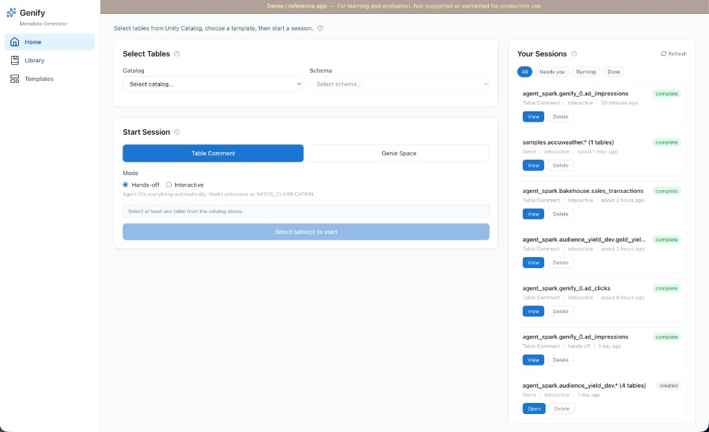
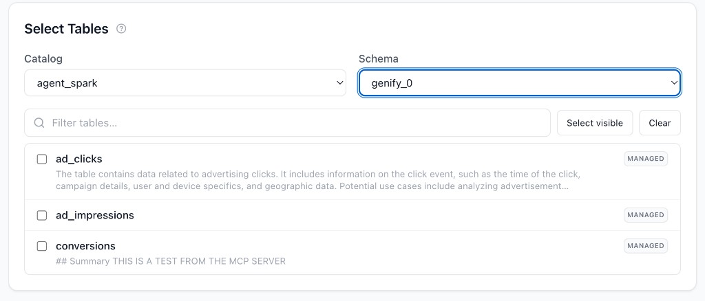
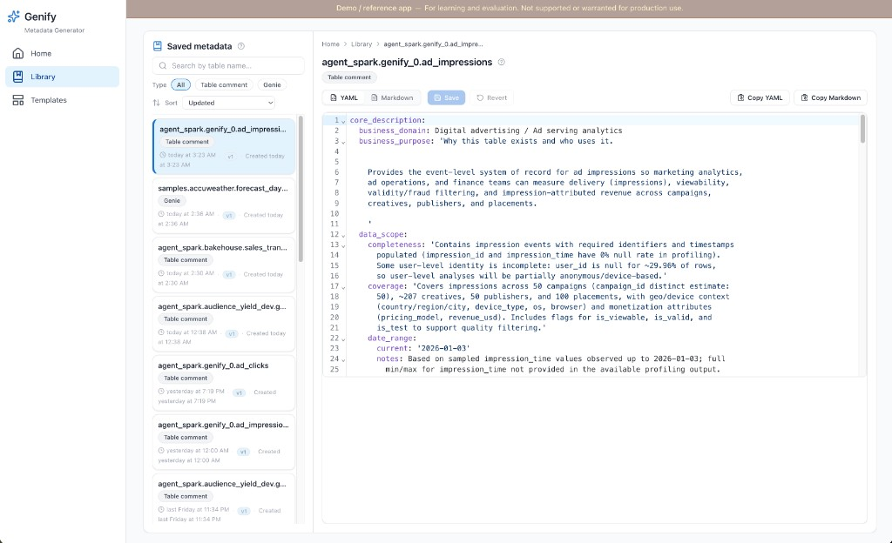
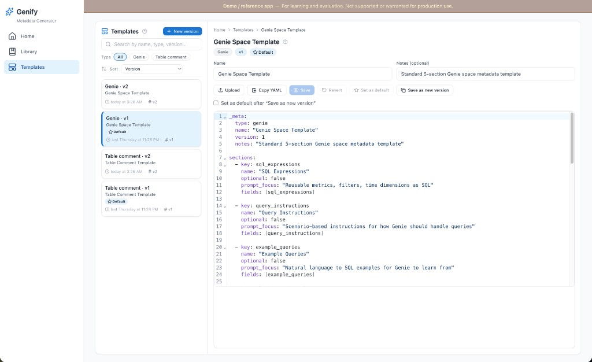

# Genify V2

> **Demo / reference implementation** — This app illustrates patterns for Databricks Apps, MCP, and agentic metadata workflows. It is **not** a production product: no enterprise SLA, hardening guarantees, or long-term support commitment. Use it to learn, fork, and adapt.

Genify is an **AI-assisted metadata generator**: it helps you build better **Unity Catalog table comments** and **Genie space**-oriented metadata using templates you can **own and version** for different teams or use cases. Pick tables from your catalog, run an agent session grounded in MCP tool context, then save results to the **Library**.

**Reference demo:** an agentic app on **Databricks Apps** wired to **managed MCP** (UC functions), a **custom MCP** profiler app, **Lakebase**, and **Foundation Model** serving—see [docs/product-overview.md](docs/product-overview.md) for the product story.

Full documentation: **[docs/README.md](docs/README.md)** — start with **[docs/product-overview.md](docs/product-overview.md)** and **[docs/architecture.md](docs/architecture.md)** (Mermaid diagrams: system context, MCP topology, deploy flow, agent sequence). Session UX (transcript, SSE lifecycle, single-tab note): [architecture.md §5](docs/architecture.md#5-agent-session-sequence-simplified) and [ADR-9](docs/design-decisions.md#adr-9-transcript-first-session-ui).

### Screenshots

**Home** — Unity Catalog catalog/schema pickers, **Select Tables**, Table comment vs Genie Space, hands-off vs interactive, **Your Sessions** (status filters).



**Select Tables** — Filter tables, **Select visible** / **Clear**, table type pill (e.g. MANAGED).



**Library** — saved metadata cards, YAML / Markdown editor, copy and save.



**Templates** — versioned template YAML (`_meta`, `sections`), search and filters, default version.



**Session flows** (MCP gather, activity trace, hands-off vs interactive, YAML streaming) — see [docs/product-overview.md — Session experience](docs/product-overview.md#session-experience-mcp-trace-hands-off-vs-interactive). Full figure set: [docs/ui-design.md](docs/ui-design.md), [docs/images/README.md](docs/images/README.md).

---

## What this demonstrates

| Pattern | Implementation |
|---------|----------------|
| **Managed MCP** | UC functions at `/api/2.0/mcp/functions/{catalog}/{schema}` |
| **Custom MCP** | Profiler Databricks App at `{app_url}/mcp` (FastMCP) |
| **Agent loop** | MCP context → LLM plan → step execution → **SSE** streaming |
| **Persistence** | **Lakebase** (PostgreSQL) for templates, sessions, outputs |
| **Deploy** | Single pipeline: UC SQL → profiler app → Genify app ([`deploy.sh`](deploy.sh)) |

---

## Stack (summary)

| Layer | Technology |
|-------|------------|
| Frontend | React 18, Tailwind, Vite |
| Backend | FastAPI, Uvicorn |
| Agent + MCP | `databricks-mcp`, `WorkspaceClient`, registry in `backend/mcp/` |
| LLM | Databricks serving endpoints (e.g. GPT-5.2, Gemini Flash) |
| State DB | Lakebase via psycopg3 |

---

## Repository layout

```
genify/
├── deploy.sh                    # UC functions + profiler + Genify
├── deploy.config.example.yaml   # Copy → deploy.config.yaml (gitignored)
├── scripts/deploy/              # Modular bash + Genify resource PATCH (SDK)
├── docs/                        # Architecture, MCP, deploy, security, extending
├── tests/                       # Python tests (+ requirements-test.txt)
├── scripts/                     # deploy/, setup_test_venv.sh, run_tests.sh
├── src/genify/                  # Main app (app.yaml, backend/, frontend/)
├── src/mcp-profiler/            # Custom MCP server app
└── uc_functions/                # SQL for UC functions (managed MCP tools)
```

---

## Quick start

### Local development

```bash
# Terminal 1 — API
cd src/genify && pip install -r requirements.txt
uvicorn backend.main:app --reload --host 0.0.0.0 --port 8000

# Terminal 2 — UI
cd src/genify/frontend && npm install && npm run dev
```

Open http://localhost:5173 — Vite proxies `/api/*` to port 8000. You need Databricks auth env vars for MCP/LLM locally (see [src/genify/README.md](src/genify/README.md)).

### Tests

From the repo root (creates gitignored **`.venv-test/`**):

```bash
./scripts/setup_test_venv.sh
./scripts/run_tests.sh
```

Details: [tests/README.md](tests/README.md).

### Deploy to Databricks

1. Copy `deploy.config.example.yaml` → `deploy.config.yaml`.
2. Set **`warehouse_id`**, Lakebase (**`lakebase_instance_name`** + **`lakebase_database_name`**, or autoscaling **`postgres_branch`** / **`postgres_database`**), LLM endpoint names, UC catalog/schema.
3. Install deploy tooling: `pip install -r scripts/deploy/requirements.txt` (PyYAML + `databricks-sdk`).
4. Run:

```bash
databricks auth login --profile <your-profile>
./deploy.sh --profile <your-profile>
```

Details: **[docs/deploy.md](docs/deploy.md)**.

---

## Documentation index

| Doc | Topic |
|-----|--------|
| [docs/product-overview.md](docs/product-overview.md) | Product story, BYO templates, Genie/table metadata |
| [docs/architecture.md](docs/architecture.md) | Three pillars, system diagrams, hands-off vs interactive, SSE, Library |
| [docs/agentic-loop.md](docs/agentic-loop.md) | `run_agent` gather → plan → execute, invariants, code map |
| [docs/ui-design.md](docs/ui-design.md) | Transcript-first UI, shell, Library, session screenshots |
| [docs/mcp-servers-and-tools.md](docs/mcp-servers-and-tools.md) | Each MCP server + tool; BYO MCP; `hidden_tools` |
| [docs/mcp-and-agents.md](docs/mcp-and-agents.md) | Managed vs custom MCP, deps, troubleshooting |
| [docs/llm-and-tokens.md](docs/llm-and-tokens.md) | Token budgets, `context_truncation`, streaming vs LLM |
| [docs/deploy.md](docs/deploy.md) | End-to-end deploy |
| [docs/security-auth.md](docs/security-auth.md) | SP, bindings, secrets |
| [docs/extending.md](docs/extending.md) | Add servers, UC SQL, fork |
| [docs/design-decisions.md](docs/design-decisions.md) | ADR-style rationale |

---

## Contributing

See [CONTRIBUTING.md](CONTRIBUTING.md). Security reports: [SECURITY.md](SECURITY.md). License: [LICENSE](LICENSE) (Apache-2.0).
