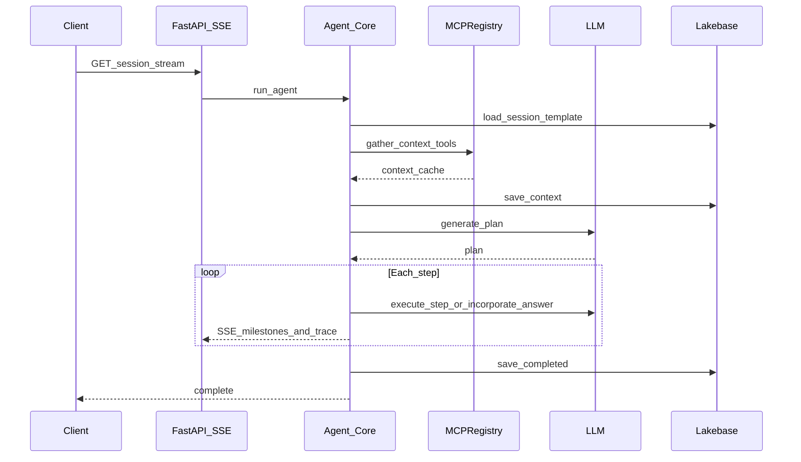
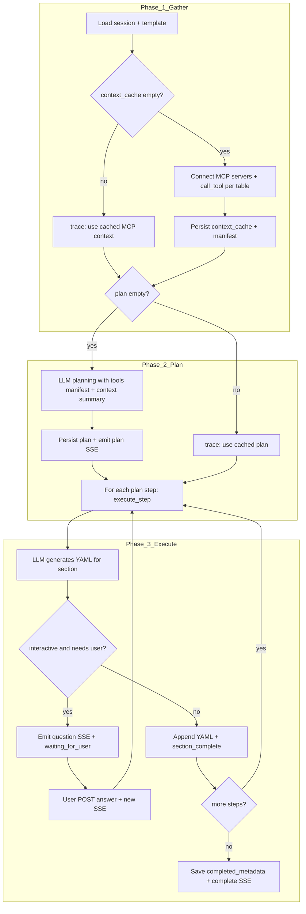

# Genify agentic loop

This document describes the **gather → plan → execute** orchestration in Genify: how `run_agent` drives MCP context gathering, LLM planning, per-section execution, optional interactive pauses, and finalization. It complements **[architecture.md](architecture.md)** (system context, MCP topology, UI, full SSE table) and **[mcp-and-agents.md](mcp-and-agents.md)** (MCP wiring, gather policy, multi-worker).

**Scope:** server-side agent behavior in [`src/genify/backend/agent/core.py`](../src/genify/backend/agent/core.py). The browser contract (EventSource, `question` / `POST /answer`) is summarized here; see [architecture.md §5 — Client lifecycle](architecture.md#5-agent-session-sequence-simplified) for full session UX detail.

---

## Entry point

The loop runs when the client opens the **SSE stream** `GET /api/sessions/{id}/stream`. The route invokes **`run_agent(session_id, pool)`**, an async generator that **yields** dict-shaped events consumed by `sse-starlette` and sent to the client.

Terminal states short-circuit: if the session is already **`complete`**, the handler emits **`complete`** (with existing `completed_id` if present) and returns; if **`failed`**, it emits **`error`**.

---

## Phases (ordered)

Implementation docstring in `core.py`:

1. Load session from Lakebase  
2. Load template from Lakebase  
3. Gather context via MCP tools (cached in `sessions.context_cache`)  
4. Generate plan via LLM (cached in `sessions.plan`)  
5. Execute plan steps from `current_step`, streaming events  
6. If interactive and a step needs input: emit **`question`**, set **`waiting_for_user`**, end the generator (stream ends)  
7. On resume: user message is merged via **`incorporate_answer`**, then execution continues from the same step index  
8. Finalize: YAML → Markdown, **`completed_metadata`**, **`complete`** SSE  

---

## Sequence (high level)

---

## Phase detail

### 1. Gather (MCP)

- Runs only when **`context_cache`** is empty for the session. If already populated, the agent emits a **`trace`** line and skips gather.  
- **Serialized per `session_id`** with an `asyncio.Lock`: concurrent `GET …/stream` connections do not each run a full MCP tool storm; the follower reloads the session and may see cached context after the leader finishes.  
- Implementation: `_iter_gather_context_events` → `MCPRegistry` / `call_tool` for tables in scope; results plus **`_mcp_tool_manifest`** are persisted to `context_cache`.  
- **Incomplete gather** (e.g. stream ends before gather finishes, or MCP connect fails before any payload is built) does **not** write an empty `{}` to `context_cache`, so the next `/stream` can run gather again without “locking in” an empty cache row.  
- **Fail-open:** tool exceptions or MCP error payloads are stored per tool (no retries); gather continues and planning/execution use partial context.  
- Tool selection and argument shaping: [`tool_manifest.py`](../src/genify/backend/mcp/tool_manifest.py), `_build_tool_args` in `core.py` (only tools whose schemas match known table-parameter patterns auto-gather).  

**Important:** The **executor never calls MCP** for routine section work. It only reads the **cached** context blob.

### 2. Plan (LLM)

- Runs when **`plan`** is empty (unless the session is in the **reconnect-while-paused** path—see below).  
- **`generate_plan`** in [`planner.py`](../src/genify/backend/agent/planner.py) uses the template, a **summary** of MCP context, **`_mcp_tool_manifest`** (or legacy `_tool_descriptions`), and session **`mode`** (`hands_off` | `interactive`).  
- The plan is saved to Lakebase; a later `run_agent` invocation can **reuse** it (`trace`: “Using cached plan”).  
- **`data_sources`** in plan steps (if present) is **advisory** for the planner LLM. **`execute_step`** does **not** invoke MCP per step from that list.

### 3. Execute (LLM per section)

- Steps run from **`current_step`** through `len(plan) - 1`.  
- **`generated_yaml`** is a **single merged YAML document** (see [`yaml_merge.py`](../src/genify/backend/agent/yaml_merge.py)): each section fragment must have **one top-level key** equal to that step’s **`section_key`**. Merge uses optional **nested strip** vs `template.template[section_key]` (`app.yaml` → `yaml_merge.nested_validation`). LLM **merge retries** are configurable (`merge_max_retries`); MCP is not retried.  
- For each step, either:  
  - **`execute_step`** ([`executor.py`](../src/genify/backend/agent/executor.py)) — fills the section from context + prior YAML; may set **`needs_user_input`** in interactive mode.  
  - **`incorporate_answer`** — after a pause, regenerates section YAML from the user’s reply; **`pending_section_yaml`** holds the draft until merge.  
- Progress is persisted with **`_save_step_progress`** (`current_step`, `generated_yaml`, `pending_section_yaml`, `conversation`, `executing`).  
- On pause: **`_save_waiting_state`** stores **`pending_question`** and **`pending_section_yaml`** (draft only — not yet merged into `generated_yaml`), sets **`waiting_for_user`**, and the generator **returns** (client closes stream after `question` per UX contract).  
- SSE: **`full_yaml`** carries the authoritative merged string (and optional partial preview); prefer it over **`yaml_chunk`** accumulation in the client.

### 4. Finalize

- After all steps: **`yaml_to_markdown`**, **`_save_completed`**, session status **`complete`**, emit **`complete`** with optional **`completed_id`**.

---

## Flowchart (cache + branches)

---

## Session modes

| Mode | Planner constraint | Runtime behavior |
|------|--------------------|------------------|
| **Hands-off** | Strategies **`auto_fill`** or **`skip`** only; gaps → `NEEDS_CLARIFICATION` in YAML | Single continuous run when MCP + plan succeed |
| **Interactive** | Also **`partial_fill_then_ask`**, **`ask_user`** | May pause with **`question`**; resume after **`POST …/answer`** and new stream |

Invalid plan JSON falls back via **`_fallback_plan`** in `planner.py` (hands-off: all **`auto_fill`**; interactive: **`partial_fill_then_ask`**).

---

## Invariants (for contributors)

| Topic | Rule |
|-------|------|
| MCP calls | Only in **gather** (`_iter_gather_context_events` path), not in **`execute_step`** for plan-driven work |
| `data_sources` | Planner metadata only; execution uses **`context_cache`** |
| Gather concurrency | In-process lock per `session_id`; **not** shared across Uvicorn workers |
| Tokens | All LLM calls should respect `get_config().llm` and `trim_history` — see **[llm-and-tokens.md](llm-and-tokens.md)** |
| Prompts | [`prompts.py`](../src/genify/backend/agent/prompts.py) |

---

## Code map

| Piece | File |
|-------|------|
| Orchestrator | [`backend/agent/core.py`](../src/genify/backend/agent/core.py) — `run_agent`, `_iter_gather_context_events`, persistence helpers |
| Planning | [`backend/agent/planner.py`](../src/genify/backend/agent/planner.py) — `generate_plan`, `_fallback_plan` |
| Execution | [`backend/agent/executor.py`](../src/genify/backend/agent/executor.py) — `execute_step`, `incorporate_answer` |
| SSE payloads | [`backend/agent/streamer.py`](../src/genify/backend/agent/streamer.py) — `EventStreamer` |
| MCP registry | [`backend/mcp/registry.py`](../src/genify/backend/mcp/registry.py), [`backend/mcp/client.py`](../src/genify/backend/mcp/client.py) |
| Tool manifest / gather list | [`backend/mcp/tool_manifest.py`](../src/genify/backend/mcp/tool_manifest.py) |

---

## Related documentation

| Doc | Use when |
|-----|----------|
| [architecture.md](architecture.md) | System diagram, MCP URLs, **full SSE event table**, client lifecycle, Lakebase session fields |
| [mcp-and-agents.md](mcp-and-agents.md) | Managed vs custom MCP, concurrent SSE, troubleshooting |
| [mcp-servers-and-tools.md](mcp-servers-and-tools.md) | Tool inventory, `hidden_tools` |
| [llm-and-tokens.md](llm-and-tokens.md) | `context_truncation`, summarizer |
| [extending.md](extending.md) | Changing prompts, SSE, templates |
| [design-decisions.md](design-decisions.md) | ADRs (e.g. SSE, `pending_question`, transcript) |

---

## Production note

Genify is a **demo / reference** stack. Treat reliability, cost controls, and multi-worker deployment as **your** design problem; the gather lock is **in-process** only.
