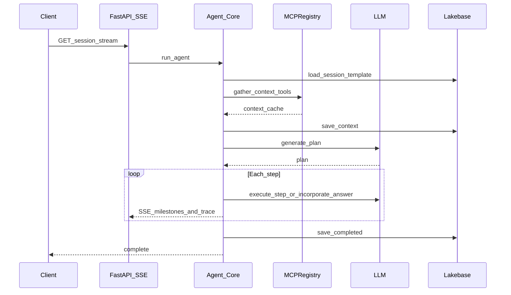
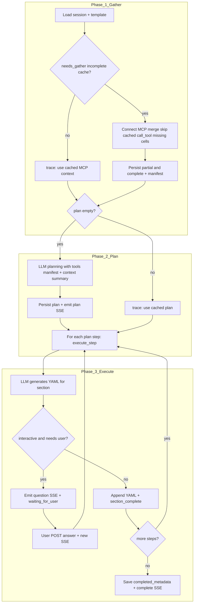

# Genify agentic loop

This document has two layers: **what** the agentic loop is as an architecture and design pattern, and **how** Genify implements it in code (`run_agent`, MCP gather, LLM plan/execute, SSE). It complements **[architecture.md](architecture.md)** (system context, MCP topology, UI, full SSE table) and **[mcp-and-agents.md](mcp-and-agents.md)** (MCP wiring, gather policy, multi-worker).

---

## The agentic loop: architecture and design

### What “agentic” means

In general, an **agentic loop** is a **closed control cycle**: the system **observes** state (goal, template, prior outputs, tool results), **decides** what to do next (a plan or the next action), **acts** (invoke tools, call the LLM, emit artifacts or questions), and **persists** progress until a terminal condition—**complete**, **failed**, or an intentional **pause** for human input. It is not a single chat completion: it is **multiple** LLM steps and, in Genify, **structured tool use** against governed data sources.

### Genify’s place in the stack

Architecturally, the loop is the **third pillar** in [architecture.md — §0 Three pillars](architecture.md#0-three-architectural-pillars): the **Genify app** ties together a **React** UI, **FastAPI** routes, **MCP** for the **data plane** (managed UC tools + optional custom MCP apps), **Foundation Model** endpoints for **planning and generation**, **Lakebase** for **durable session and template state**, and **SSE** so the browser can follow long-running work without blocking on a single HTTP response.

At a high level the pattern is **gather → plan → execute**:

| Stage | Role |
|-------|------|
| **Gather** | Populate **observations** from MCP tools (profiler, UC functions) into a **session-scoped cache** so downstream prompts stay grounded in workspace metadata. |
| **Plan** | Ask the LLM for a **structured plan** (ordered steps aligned to template sections), informed by that cache and the tool manifest—not a free-form script. |
| **Execute** | For each step, the LLM **fills** YAML under a known **section key**; outputs are **merged** into one document, with optional **interactive** pauses. |

### Design properties (why it looks like this)

- **Separation of data plane and “reasoning”:** MCP **gather** is the only routine path that **calls tools**; **execution** reads **cached** context ([ADR-14](design-decisions.md#adr-14-execution-uses-cached-mcp-context-only-plan-data_sources-is-advisory)). That keeps tool I/O predictable and avoids re-fetching UC/profiler data on every section.
- **Governed tools:** Tools are not arbitrary HTTP; they go through **MCP** and Unity Catalog where applicable ([ADR-3](design-decisions.md#adr-3-mcp-for-data-plane-access)).
- **Fail-open gather:** A bad or missing tool result is **stored** and the run **continues** with partial context ([ADR-3b](design-decisions.md#adr-3b-mcp-gather-fail-open-no-retries)).
- **Durable, resumable state:** Session rows in Lakebase hold **plan**, **context cache**, **merged YAML**, and **conversation** so reconnects and **interactive** resumes are first-class ([ADR-10](design-decisions.md#adr-10-interactive-resume--answer-queue-and-pending_question), [ADR-11](design-decisions.md#adr-11-interactive-pause--composer-draft-and-sse-lifecycle)).
- **Progress channel vs LLM metering:** **SSE** streams **status**, **trace**, **yaml**, and **questions** to the client ([ADR-2](design-decisions.md#adr-2-sse-for-agent-progress)); it is **not** a substitute for **token** or **cost** accounting—see **[llm-and-tokens.md](llm-and-tokens.md)**.

---

## Scope (this document vs architecture)

**Scope here:** server-side orchestration in [`src/genify/backend/agent/core.py`](../src/genify/backend/agent/core.py)—phases, cache rules, planner vs executor boundaries, and contributor invariants.

**Session UX** (EventSource lifecycle, `question` / `POST /answer`, transcript vs trace): [architecture.md §5 — Client lifecycle](architecture.md#5-agent-session-sequence-simplified) and [ui-design.md](ui-design.md).

**Below:** concrete **implementation**—entry point, ordered phases, sequences, and flowcharts.

---

## Entry point

The loop runs when the client opens the **SSE stream** `GET /api/sessions/{id}/stream`. The route invokes **`run_agent(session_id, pool)`**, an async generator that **yields** dict-shaped events consumed by `sse-starlette` and sent to the client.

Terminal states short-circuit: if the session is already **`complete`**, the handler emits **`complete`** (with existing `completed_id` if present) and returns; if **`failed`**, it emits **`error`**.

---

## Phases (ordered)

Implementation docstring in `core.py`:

1. Load session from Lakebase  
2. Load template from Lakebase  
3. Gather context via MCP tools (cached in `sessions.context_cache`)  
4. Generate plan via LLM (cached in `sessions.plan`)  
5. Execute plan steps from `current_step`, streaming events  
6. If interactive and a step needs input: emit **`question`**, set **`waiting_for_user`**, end the generator (stream ends)  
7. On resume: user message is merged via **`incorporate_answer`**, then execution continues from the same step index  
8. Finalize: YAML → Markdown (**`safe_yaml_to_markdown`** — hierarchical mirror of the parsed YAML tree, best-effort), upsert/finalize **`completed_metadata`**, **`complete`** SSE (may include **`markdown_export_failed`**)  

**Progressive Library:** `_save_step_progress` and `_save_waiting_state` upsert a **draft** `completed_metadata` row (combined YAML, **`artifact_status` = `in_progress`**) and set **`sessions.library_artifact_id`**. Finalize **updates** that row to **`complete`** when present instead of inserting a duplicate primary row.

**Merge forgiveness:** `merge_section_output` is wrapped in **try/except**; on failure the session is **`failed`** with **`error_code` `yaml_merge_invalid`**, the SSE emits **`error`** with the same code, prior **`generated_yaml`** stays in the DB, and the Library draft is marked **`merge_error`**.

**Restart:** `POST /api/sessions/{id}/restart` clears plan, YAML, conversation, cache, errors, and **`library_artifact_id`**; deletes **draft** `completed_metadata` for that session; sets **`session_id` NULL** on **`complete`** rows so Library history remains without stale links.

---

## Sequence (high level)

---

## Phase detail

### 1. Gather (MCP)

- Runs when **`_mcp_needs_gather(context_cache)`** is true: cache is **empty** or **`_mcp_gather_complete`** is not `true`. **Partial** caches (some table/tool cells already saved) **resume** gather: existing cells are **merged** from the DB, **`call_tool` is skipped** for cells that already exist, and **`trace`** may show **skip cached** for those cells. If gather is not needed, the agent emits **`trace`: “Using cached MCP context”** and skips gather.  
- **Serialized per `session_id`** with an `asyncio.Lock`: concurrent `GET …/stream` connections do not each run a full MCP tool storm; the follower reloads the session and may see **partial or complete** cached context after the leader saves.  
- Implementation: `_iter_gather_context_events` → merge seed → `MCPRegistry` / `call_tool` only for **missing** `(table_fqn, tool_name)` cells; **`_mcp_tool_manifest`** is rebuilt each run; **`_mcp_gather_complete: true`** is set only when every expected cell exists. **`UPDATE`s** may occur **after each new cell** (partial) and once at completion.  
- **Incomplete gather** (e.g. stream ends before gather finishes, or MCP connect fails before any payload is built) does **not** write an empty `{}` to `context_cache`, so the next `/stream` can run gather again without “locking in” an empty cache row.  
- **Fail-open:** tool exceptions or MCP error payloads are stored per tool (no retries within a cell); existing **error cells are skipped** on reconnect like any other filled cell. Gather continues and planning/execution use partial context.  
- Tool selection and argument shaping: [`tool_manifest.py`](../src/genify/backend/mcp/tool_manifest.py), `_build_tool_args` in `core.py` (only tools whose schemas match known table-parameter patterns auto-gather).  

**Important:** The **executor never calls MCP** for routine section work. It only reads the **cached** context blob.

### 2. Plan (LLM)

- Runs when **`plan`** is empty (unless the session is in the **reconnect-while-paused** path—see below).  
- **`generate_plan`** in [`planner.py`](../src/genify/backend/agent/planner.py) uses the template, a **summary** of MCP context, **`_mcp_tool_manifest`** (or legacy `_tool_descriptions`), and session **`mode`** (`hands_off` | `interactive`).  
- The plan is saved to Lakebase; a later `run_agent` invocation can **reuse** it (`trace`: “Using cached plan”).  
- **`data_sources`** in plan steps (if present) is **advisory** for the planner LLM. **`execute_step`** does **not** invoke MCP per step from that list.

### 3. Execute (LLM per section)

- Steps run from **`current_step`** through `len(plan) - 1`.  
- **`generated_yaml`** is a **single merged YAML document** (see [`yaml_merge.py`](../src/genify/backend/agent/yaml_merge.py)): each section fragment must have **one top-level key** equal to that step’s **`section_key`**. Merge uses optional **nested strip** vs `template.template[section_key]` (`app.yaml` → `yaml_merge.nested_validation`). LLM **merge retries** are configurable (`merge_max_retries`); MCP is not retried.  
- For each step, either:  
  - **`execute_step`** ([`executor.py`](../src/genify/backend/agent/executor.py)) — fills the section from context + prior YAML; may set **`needs_user_input`** in interactive mode.  
  - **`incorporate_answer`** — after a pause, regenerates section YAML from the user’s reply; **`pending_section_yaml`** holds the draft until merge.  
- Progress is persisted with **`_save_step_progress`** (`current_step`, `generated_yaml`, `pending_section_yaml`, `conversation`, `executing`).  
- On pause: **`_save_waiting_state`** stores **`pending_question`** and **`pending_section_yaml`** (draft only — not yet merged into `generated_yaml`), sets **`waiting_for_user`**, and the generator **returns** (client closes stream after `question` per UX contract).  
- SSE: **`full_yaml`** carries the authoritative merged string (and optional partial preview); prefer it over **`yaml_chunk`** accumulation in the client.

#### Canonical YAML format at persistence (optional)

When **`config.yaml_merge.format_on_persist_enabled`** is true, **`core.py`** runs **`format_yaml_for_persistence`** in [`yaml_merge.py`](../src/genify/backend/agent/yaml_merge.py) immediately before persisting a **single merged** `generated_yaml` (step boundaries, finalize, merge-error Library upserts, and **`PUT /api/completed/{id}`**). Re-dump uses **`format_dump_width`** and optional **`format_multiline_literals`** (`|` for embedded newlines). **Fail-open:** parse errors leave the string unchanged; Activity **`trace`** may record apply, finalize-only “disabled”, or invalid-YAML skip. **`generated_json`** is written after the final formatted string when dual-write is enabled. Interactive **pending** preview for Library uses **formatted committed YAML + raw pending fragment**, never a parse of the concat.

### 4. Finalize

- After all steps: **`yaml_to_markdown`** (same hierarchical renderer for all template types; **`table_comment`** unwraps single-key FQN wrappers first), **`_save_completed`**, session status **`complete`**, emit **`complete`** with optional **`completed_id`**.

---

## Flowchart (cache + branches)

---

## Session modes

| Mode | Planner constraint | Runtime behavior |
|------|--------------------|------------------|
| **Hands-off** | Strategies **`auto_fill`** or **`skip`** only; gaps → `NEEDS_CLARIFICATION` in YAML | Single continuous run when MCP + plan succeed |
| **Interactive** | Also **`partial_fill_then_ask`**, **`ask_user`** | May pause with **`question`**; resume after **`POST …/answer`** and new stream |

Invalid plan JSON falls back via **`_fallback_plan`** in `planner.py` (hands-off: all **`auto_fill`**; interactive: **`partial_fill_then_ask`**).

---

## Invariants (for contributors)

| Topic | Rule |
|-------|------|
| MCP calls | Only in **gather** (`_iter_gather_context_events` path), not in **`execute_step`** for plan-driven work |
| `data_sources` | Planner metadata only; execution uses **`context_cache`** |
| Gather concurrency | In-process lock per `session_id`; **not** shared across Uvicorn workers |
| Tokens | All LLM calls should respect `get_config().llm` and `trim_history` — see **[llm-and-tokens.md](llm-and-tokens.md)** |
| Prompts | [`prompts.py`](../src/genify/backend/agent/prompts.py) |

---

## Code map

| Piece | File |
|-------|------|
| Orchestrator | [`backend/agent/core.py`](../src/genify/backend/agent/core.py) — `run_agent`, `_iter_gather_context_events`, persistence helpers |
| Planning | [`backend/agent/planner.py`](../src/genify/backend/agent/planner.py) — `generate_plan`, `_fallback_plan` |
| Execution | [`backend/agent/executor.py`](../src/genify/backend/agent/executor.py) — `execute_step`, `incorporate_answer` |
| SSE payloads | [`backend/agent/streamer.py`](../src/genify/backend/agent/streamer.py) — `EventStreamer` |
| MCP registry | [`backend/mcp/registry.py`](../src/genify/backend/mcp/registry.py), [`backend/mcp/client.py`](../src/genify/backend/mcp/client.py) |
| Tool manifest / gather list | [`backend/mcp/tool_manifest.py`](../src/genify/backend/mcp/tool_manifest.py) |

---

## Related documentation

| Doc | Use when |
|-----|----------|
| [architecture.md](architecture.md) | System diagram, MCP URLs, **full SSE event table**, client lifecycle, Lakebase session fields |
| [mcp-and-agents.md](mcp-and-agents.md) | Managed vs custom MCP, concurrent SSE, troubleshooting |
| [mcp-servers-and-tools.md](mcp-servers-and-tools.md) | Tool inventory, `hidden_tools` |
| [llm-and-tokens.md](llm-and-tokens.md) | `context_truncation`, cost heuristics, **summarizer not used by default agent** |
| [extending.md](extending.md) | Changing prompts, SSE, templates |
| [design-decisions.md](design-decisions.md) | ADRs (e.g. SSE, `pending_question`, transcript) |

---

## Production note

Genify is a **demo / reference** stack. Treat reliability, cost controls, and multi-worker deployment as **your** design problem; the gather lock is **in-process** only.
