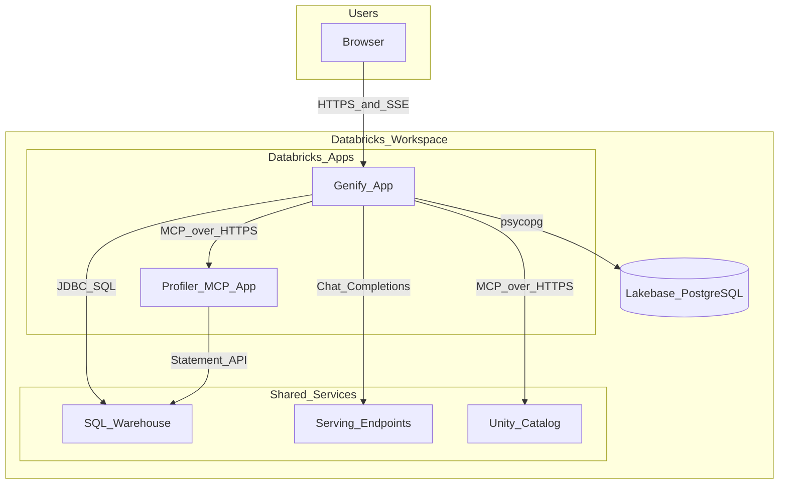
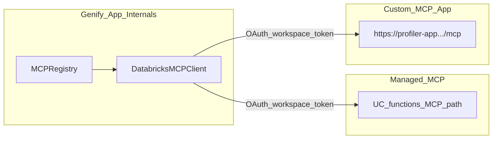
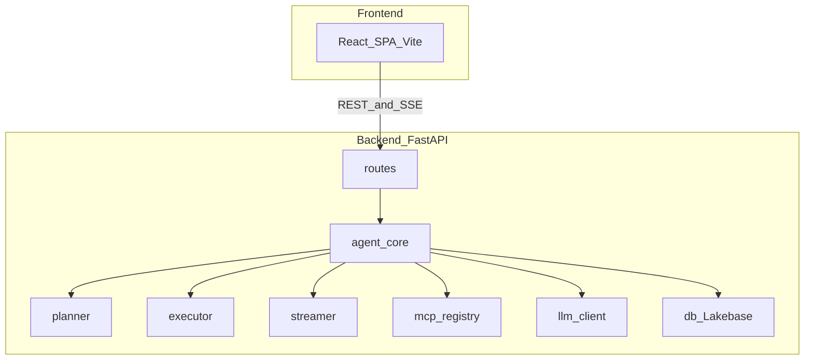
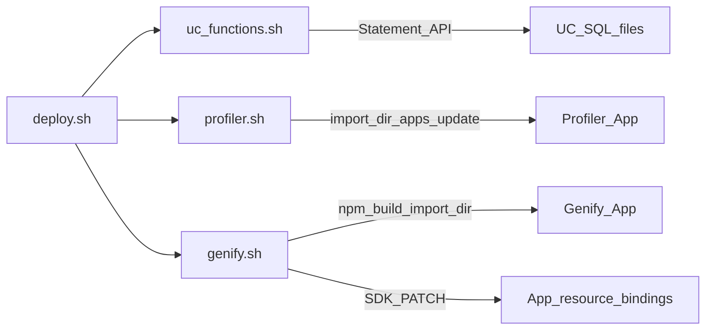
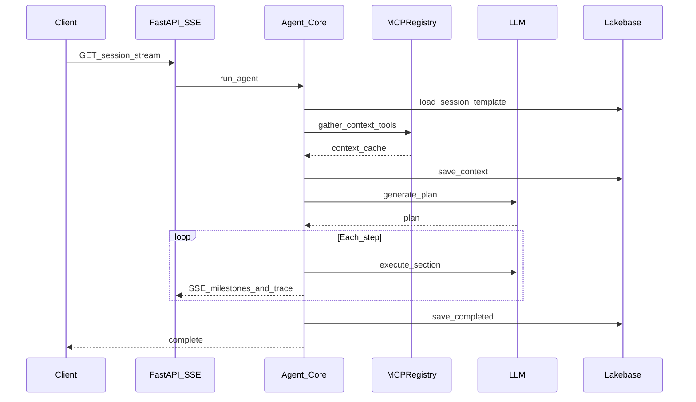
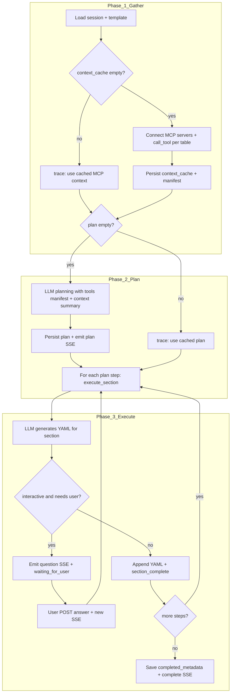
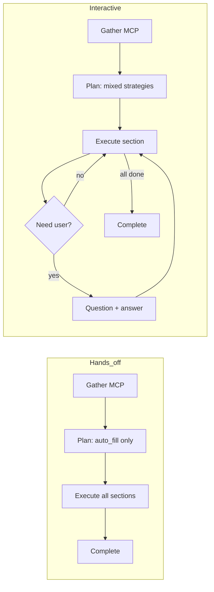

# Architecture

Genify is a **Databricks App** (Python FastAPI + static React) that runs an **agent loop**: gather context via **MCP tools**, plan with an LLM, execute steps, stream progress over **SSE**, and persist state in **Lakebase**.

**Production disclaimer:** the shipped architecture is a **demo / reference** stack. Treat security, reliability, cost controls, and data governance as **your responsibility** if you fork or deploy beyond a lab.

---

## 0. Three architectural pillars

This repository is intentionally **three demos in one coherent stack**. Each piece can be studied or forked on its own; together they show how an agentic Databricks App consumes both **managed** and **custom** MCP.

| Pillar | What it is | In this repo |
|--------|------------|--------------|
| **1. Custom MCP server (Databricks App)** | A separate app that exposes tools over MCP (HTTP), often backed by a SQL warehouse or internal APIs. | [`src/mcp-profiler/`](../src/mcp-profiler/) — FastMCP at `/mcp`. Deploy: [`scripts/deploy/profiler.sh`](../scripts/deploy/profiler.sh). |
| **2. Unity Catalog functions → managed MCP** | UC SQL (or other managed tool sources) published as invokable tools at the workspace managed MCP URL. | [`uc_functions/`](../uc_functions/) deployed in order by [`scripts/deploy/uc_functions.sh`](../scripts/deploy/uc_functions.sh). Wiring: [`src/genify/app.yaml`](../src/genify/app.yaml) `uc_managed` server. |
| **3. Agentic Genify app (Databricks App)** | UI + API + **gather → plan → execute** loop, LLM calls, SSE to the browser, Lakebase persistence. | [`src/genify/`](../src/genify/) — agent in [`backend/agent/`](../src/genify/backend/agent/), MCP clients in [`backend/mcp/`](../src/genify/backend/mcp/), session stream routes under [`backend/routes/`](../src/genify/backend/routes/). |

The diagrams in **§1–4** below zoom into topology, internal layers, deploy order, and the session sequence. MCP protocol details and troubleshooting live in [mcp-and-agents.md](mcp-and-agents.md). **Adding servers:** you can bring **additional MCP apps or UC schemas** via `app.yaml` — see [mcp-servers-and-tools.md — Bring your own MCP servers](mcp-servers-and-tools.md#bring-your-own-mcp-servers).

---

## 1. System context

High-level actors and where they run inside a Databricks workspace.

| Boundary | Responsibility |
|----------|----------------|
| **Genify App** | UI, API, agent orchestration, LLM calls, MCP client, Lakebase persistence |
| **Profiler App** | Custom MCP server; profiling tools backed by SQL warehouse |
| **UC managed MCP** | Tools backed by UC functions in a catalog/schema (deployed from `uc_functions/`) |
| **Lakebase** | Templates, sessions, completed metadata (PostgreSQL) |
| **Serving endpoints** | Foundation models (e.g. GPT-5.2, Gemini Flash) |

---

## 2. MCP topology (managed + custom)

This repo is structured to demonstrate **two MCP integration patterns** in one agent:

| Server (logical name) | Type | URL resolution | Defined in |
|----------------------|------|----------------|------------|
| `uc-functions` | Managed | `{DATABRICKS_HOST}/api/2.0/mcp/functions/{catalog}/{schema}` | [`src/genify/app.yaml`](../src/genify/app.yaml) `uc_catalog` / `uc_schema` |
| `profiler` | Custom app | `{apps.get(app_name).url}/mcp` | Same file, `databricks_app` + `app_name` |

Implementation: [`src/genify/backend/mcp/client.py`](../src/genify/backend/mcp/client.py) resolves URLs and constructs `DatabricksMCPClient` from the `databricks-mcp` package.

Official URL patterns and concepts: [Databricks managed MCP servers](https://docs.databricks.com/gcp/en/generative-ai/mcp/managed-mcp).

---

## 3. Genify app — internal layers

| Directory | Role |
|-----------|------|
| [`backend/routes/`](../src/genify/backend/routes/) | HTTP: sessions (SSE), catalog, templates, completed metadata, health |
| [`backend/agent/`](../src/genify/backend/agent/) | `run_agent` loop: context → plan → execute → finalize; [`streamer.py`](../src/genify/backend/agent/streamer.py) formats SSE payloads including **`trace`** (verbose) and milestone events |
| [`backend/mcp/`](../src/genify/backend/mcp/) | Per-server MCP clients + registry |
| [`backend/llm/`](../src/genify/backend/llm/) | Foundation model client, token helpers |
| [`backend/db.py`](../src/genify/backend/db.py) | Lakebase pool, schema init, template seeding |

---

## 4. Deploy topology

Deploy is **one script** so UC functions, the profiler app, and Genify stay in sync.

1. **`uc_functions/`** — SQL files applied in fixed order (creates/replaces UC functions used by managed MCP).
2. **`profiler.sh`** — Upload `src/mcp-profiler`, `databricks apps update` (warehouse resource), `apps deploy`.
3. **`genify.sh`** — Build frontend, upload `src/genify`, **[`genify_app_update_resources.py`](../scripts/deploy/genify_app_update_resources.py)** PATCH for warehouse, serving endpoints, Lakebase **database** (Provisioned) or **postgres** (Autoscaling), then `apps deploy`.

Details: [deploy.md](deploy.md).

---

## 5. Agent session sequence (simplified)

**Dedicated doc:** For the full **gather → plan → execute** narrative, cache rules, planner vs executor invariants, and a contributor code map in one place, see **[agentic-loop.md](agentic-loop.md)**. The subsections below keep the **sequence diagrams**, **hands-off vs interactive** detail, **client lifecycle**, **SSE event table**, and **UI mapping** alongside the rest of this architecture page.

From [`backend/agent/core.py`](../src/genify/backend/agent/core.py) `run_agent`:

### Agent loop phases (gather → plan → execute)

The orchestration lives in [`run_agent`](../src/genify/backend/agent/core.py). Conceptually:

- **Gather** runs once per session (unless cache already populated); see [mcp-and-agents.md — Concurrent SSE](mcp-and-agents.md#concurrent-sse-and-mcp-gather).
- **Plan** is produced by the LLM from template sections + MCP context summary + mode (`hands_off` | `interactive`); prompts in [`prompts.py`](../src/genify/backend/agent/prompts.py).
- **Execute** walks plan steps; interactive pauses **do not** re-gather MCP — they merge user text into the running YAML via `incorporate_answer` on the next stream.

### Hands-off vs interactive design

The session **mode** is chosen on Home when starting a session. It changes **planning constraints** and **executor behavior**, not the MCP servers themselves.

| Mode | Planner intent (from `PLANNING_PROMPT`) | User experience |
|------|----------------------------------------|-----------------|
| **Hands-off** | Strategies must be **`auto_fill` or `skip` only** — no user questions. Uncertain fields → `NEEDS_CLARIFICATION: …` in YAML. | Single stream: gather → plan → all sections → complete. Activity trace shows MCP + LLM work; YAML streams as sections finish. |
| **Interactive** | Strategies may be **`auto_fill`**, **`partial_fill_then_ask`**, **`ask_user`**, or **`skip`**. Prefer data-backed fills, then 1–2 targeted questions. | Same gather/plan, but executor may emit **`question`** SSE, set `waiting_for_user`, and stop the stream until **`POST …/answer`**; then a **new** SSE run continues with merged answers. |

Fallback planning (if the LLM returns invalid JSON) uses [`_fallback_plan`](../src/genify/backend/agent/planner.py): **`auto_fill`** per section in hands-off, **`partial_fill_then_ask`** in interactive.

During **gather**, **plan**, and **execute**, the server may emit many **`trace`** SSE events (tool calls, LLM phases, cache hints). The **session page** shows:

- A **conversation transcript** (assistant / user / system)—plan summaries, questions, answers, completion—built from SSE plus **hydration** from `GET /api/sessions/{id}` (`conversation` in Lakebase) so **Resume** is not an empty thread.
- An **activity trace** panel for `trace` lines only—**collapsed by default**; operators can expand and copy.

If `context_cache` or `plan` already exists on the session, the agent skips recomputation and emits **`trace`** lines such as “Using cached MCP context” / “Using cached plan”.

Interactive mode can pause with `waiting_for_user`, resume on answer — same loop, persisted in `genify.sessions`. The row may include **`pending_question`** (JSON): same payload shape as the SSE `question` event, so reconnect or page refresh can restore the composer without re-running the section LLM.

### Client lifecycle (browser)

1. Load session with **TanStack Query**: `GET /api/sessions/{id}` (loading/error UI, retry). If `status` is `waiting_for_user` and **`pending_question`** is set, the UI can show the composer immediately. The client seeds an internal **pause key** from `section` + `field` + `question` text so the first SSE replay of the same pause does not reset the composer draft.
2. Open **`EventSource`** on `GET /api/sessions/{id}/stream`. The **`open`** handler flips UI from “Connecting…” to “Working…” **only when no question is already shown** (avoids briefly disabling the composer on refresh when `pending_question` hydrated first). If the client connects while still paused (last `conversation` message is assistant), the server may **re-emit** `question` from `pending_question` and end the stream without duplicate `execute_step` work.
3. On **`question`**, show composer; **client closes the `EventSource` after handling the event** so the browser does not **auto-reconnect** in a loop while the user types. Repeated **`question`** payloads for the **same pause** (same section / field / question text) **update** composer state (e.g. `suggested_answer`) but **do not** clear the textarea. User submits **`POST /api/sessions/{id}/answer`**. The session **stays `waiting_for_user`** until `run_agent` runs **`incorporate_answer`** on the next stream, then advances `current_step` and sets **`executing`**. **409** cases: `not_waiting_for_user` if not paused; **`answer_already_queued`** if the last `conversation` message is already `user` (open/reconnect SSE first).
4. After **`POST /answer`**, close the stream (if any) and open a **new** `EventSource` to resume execution—there is **no** live SSE while the user is composing an answer after step 3. On reconnect while **`waiting_for_user`** (last `conversation` message is assistant, `pending_question` set), the server **does not** re-emit **`plan`**—only a short **`trace`** plus **`question`**—so the transcript is not flooded with duplicate “Plan ready” rows. The client also dedupes assistant text and accepts at most **one** plan row per stream session from SSE.

**SSE close vs “connection issue”:** After **`question`**, the HTTP response often ends normally; browsers may still fire **`EventSource` `error`**. While the composer is showing an active **`question`**, the UI **suppresses** the amber connection warning so users are not nudged to refresh during an expected pause. A **WifiOff** chip in the session header (hover for full text) appears only when a debounced error fires **without** an active question (or other genuine disconnect cases). Proxies may still need idle-timeout tuning for long runs.

**Planner vs executor:** The LLM plan may list **`data_sources`** (tool names) per step; **`execute_step`** does **not** invoke MCP per step from that list—it uses the **pre-gathered** `context_cache` from the gather phase. Treat **`data_sources`** as planner rationale, not a runtime tool schedule.

**Concurrent streams:** `run_agent` serializes **MCP gather** per `session_id` in-process (`asyncio.Lock` + reload `context_cache` in [`core.py`](../src/genify/backend/agent/core.py)) so overlapping `GET …/stream` connections do not each run a full tool storm before the first save. Planning and execution can still overlap across streams; **multiple Uvicorn workers** do not share that lock—prefer one worker or see [mcp-and-agents.md — Concurrent SSE](mcp-and-agents.md#concurrent-sse-and-mcp-gather). One tab per session is still recommended for UX.

**APX-style alignment:** manual `EventSource`, FastAPI + Vite SPA, and `app.yaml` resources mirror patterns promoted by the [APX toolkit](https://github.com/databricks-solutions/apx) for Databricks Apps (see also [skills/apx](https://github.com/databricks-solutions/apx/tree/main/skills/apx)); Genify’s agent remains Python, not APX’s Rust CLI.

### Design principles (UI)

High-level UX goals—transcript-first session, responsive shell, progressive disclosure, Library editing—are summarized in **[ui-design.md](ui-design.md)**. The table below maps them to concrete components.

### Frontend UI surfaces

| Area | Components (under `src/genify/frontend/src/`) | Notes |
|------|-----------------------------------------------|--------|
| **Shell** | `App.jsx`, `layout/AppShell.jsx`, `layout/AppSidebar.jsx`, `ScrollToTop.jsx`, `PageSkeleton.jsx`, `NotFound.jsx` | **Desktop:** persistent left sidebar (~240px) — **Home**, **Library** — plus full-width main (`flex-1 min-w-0`). **&lt; md:** hamburger + slide-over drawer + backdrop; drawer closes on route change. No `max-w-6xl` cap on workspace. |
| **Home** | `Home.jsx`, `CatalogBrowser.jsx`, `SessionLauncher.jsx`, `SessionList.jsx` | Catalog via TanStack Query; **Select Tables** list: comment `line-clamp` preview + full text on hover; compact table-type pill; table filter + select visible/clear; launcher; session list filters, relative `updated_at`, `ConfirmDialog` for delete. **`HelpHint`** on section titles where useful. |
| **Library** | `library/LibraryLayout.jsx`, `library/LibraryList.jsx`, `library/LibraryDetail.jsx` | **`/library`** master–detail on `lg+` (card list + outlet). **`/library/:completedId`** detail: YAML \| Markdown toggle, CodeMirror edit, validate (`js-yaml`), Save / Revert, Copy YAML / Copy Markdown. Cards show `table_fqn` or **Combined** for multi-table sessions. Mobile: stacked list ↔ detail with back. |
| **Session** | `SessionView.jsx`, `SessionPageHeader.jsx`, `SessionTranscript.jsx`, `QuestionComposer.jsx`, `YamlPanel.jsx`, `TracePanel.jsx`, `TranscriptMarkdown.jsx` | Status pill; markdown transcript (dimmed while agent working); **`QuestionComposer`**: full question in transcript only; suggested reply read-only panel + Use/Send suggestion + textarea (draft preserved on same-pause `question` replay; **EventSource** closed after `question`); YAML in CodeMirror; trace panel; stream warning as header **WifiOff** chip + debounced `onerror` (suppressed while `question` active); jump-to-latest when scrolled up. **Back** in header **hidden on `md+`** (sidebar provides nav). **`complete` SSE** may include **`completed_id`** → **Open in Library** + correct **`PUT /completed/{id}`** on YAML save (via ref or `GET /sessions/{id}/completed`). |
| **Shared** | `HelpHint.jsx`, `utils/tableRef.js` | Contextual **?** tooltips (hover + focus-within). Shared **table label** formatting for session + library cards. |

Shared API: [`api.js`](../src/genify/frontend/src/api.js) (`fetchJSON`, `connectSSE` with `onOpen` / `onStreamError`).

### SSE event types (session stream)

| Event | Role |
|-------|------|
| `status` | Sparse phase updates (loading, gathering_context, planning, finalizing). |
| `thinking` | Sparse section-level hint (e.g. partial fill); optional subtitle in UI. |
| `plan` | Plan payload (steps, counts); UI humanizes strategies. |
| `yaml_chunk` | Incremental YAML for the preview panel. |
| `section_complete` | Step finished. |
| `question` | Interactive pause; client closes SSE after handling, POSTs answer, then opens a **new** SSE stream to resume. |
| `complete` | Final YAML + session id; optional **`completed_id`** (UUID of the primary `completed_metadata` row — combined row for multi-table, or the single row for one table). Client uses it for Library deep link and for saving YAML edits without guessing by `template_type`. |
| `error` | Failure. |
| `trace` | Verbose diagnostic log only (categories e.g. `tool`, `llm`, `plan`, `system`); Activity trace panel only. |

Client registration: [`src/genify/frontend/src/api.js`](../src/genify/frontend/src/api.js) `connectSSE` (`EventSource` listeners + optional `onOpen`).

---

## 6. Lakebase data model (summary)

| Table | Purpose |
|-------|---------|
| `genify.templates` | Versioned YAML templates |
| `genify.sessions` | Session state, context cache, plan, conversation |
| `genify.completed_metadata` | Saved outputs after a session completes: YAML + derived Markdown |

### `completed_metadata` rows

- **`table_fqn`** (`VARCHAR`, nullable): when set, this row is **per-table** (`catalog.schema.table`). When **NULL**, the row is the **combined** artifact for a **multi-table** session (full `generated_yaml` in one blob).
- **Single-table session:** one insert with `table_fqn` set (no separate combined row).
- **Multi-table session:** one **combined** row (`table_fqn` NULL) plus one row per table (`table_fqn` set). When the merged YAML is partitioned by top-level FQN keys, each per-table row stores **only the inner document** (same top-level shape as `table_comment` templates: `table_identity`, `core_description`, …) so `yaml_to_markdown` and the Library editor stay consistent. If keys do not match, each per-table row may still fall back to the full combined YAML.
- **`GET /api/completed`** lists all rows for the user (Library cards). **`GET /api/sessions/{id}/completed`** returns rows for that session (ordered: combined first, then per-table by `table_fqn`).
- **`PUT /api/completed/{id}`** updates one row and **recomputes** `markdown_content` server-side (`yaml_to_markdown`); YAML remains the source of truth.

Schema name is configurable under `config.lakebase.schema` in app config.

### Completed-metadata API (quick reference)

| Method | Path | Role |
|--------|------|------|
| `GET` | `/api/completed` | List items for current user (`table_fqn` included). |
| `GET` | `/api/completed/{id}` | Full row (YAML + markdown). |
| `PUT` | `/api/completed/{id}` | Body `{ "yaml_content": "..." }`; regenerates markdown. |
| `DELETE` | `/api/completed/{id}` | Remove one row. |
| `GET` | `/api/sessions/{session_id}/completed` | All completed rows for that session (empty list if none). |

---

## Next steps

- **MCP tool inventory + BYO:** [mcp-servers-and-tools.md](mcp-servers-and-tools.md)
- **MCP and UC details:** [mcp-and-agents.md](mcp-and-agents.md)
- **Deploy:** [deploy.md](deploy.md)
- **Security:** [security-auth.md](security-auth.md)
