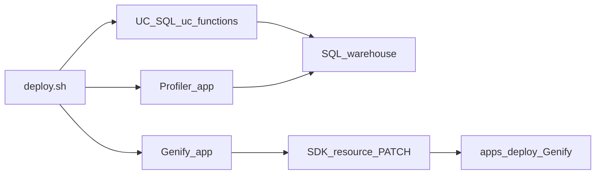

# Deploy (Databricks CLI)

**Related:** [Architecture](architecture.md) (diagrams) · [MCP and agents](mcp-and-agents.md) · [Documentation index](README.md)

---

## Deploy pipeline (overview)



---

## Before you deploy

Follow these steps once per workspace (or when you change infrastructure):

1. **SQL warehouse** — In Databricks, create or use an existing **SQL warehouse**. Start it if needed. Copy the **warehouse ID** (warehouse settings URL or `databricks sql-warehouses list -p <profile> -o json`).
2. **Lakebase** — For Genify you need a database bound as app resource `postgres` (see [`src/genify/app.yaml`](../src/genify/app.yaml)). Use one of:
   - **Provisioned** — Set **`lakebase_instance_name`** and **`lakebase_database_name`** (same values as in **Apps → your app → resources**, or `databricks apps get <app> -o json` under `resources[].database`).
   - **Autoscaling** — Set **`postgres_branch`** and **`postgres_database`** to the full resource paths (e.g. `projects/.../branches/...` and `.../databases/...`).
3. **Config** — Copy [`deploy.config.example.yaml`](../deploy.config.example.yaml) to `deploy.config.yaml` and set:
   - **`warehouse_id`** — Used for **UC function SQL** (Statement API) **and** for both apps’ `sql_warehouse` resource in `apps update` (Genify + Profiler).
   - **Lakebase** — Either **`lakebase_instance_name`** + **`lakebase_database_name`**, or **`postgres_branch`** + **`postgres_database`** (see step 2).
   - **`llm_endpoint`**, **`summarizer_endpoint`**, **`uc_catalog`**, **`uc_schema`**, app names as needed.
4. **App YAML resource names** (must match `apps update` JSON — do not rename without updating both):
   - **Genify** ([`src/genify/app.yaml`](../src/genify/app.yaml)): resource name **`sql-warehouse`** (hyphen) for `WAREHOUSE_ID` / `valueFrom`.
   - **Profiler** ([`src/mcp-profiler/app.yaml`](../src/mcp-profiler/app.yaml)): resource name **`sql_warehouse`** (underscore).
5. **Deploy** — Authenticate the CLI, then run:

```bash
./deploy.sh --profile <your-databricks-profile>
```

`warehouse_id` is **required** in `deploy.config.yaml`; the script exits early if it is missing.

---

## Deploy order

Single script runs in this **order**:

1. **UC functions** — Each SQL file in [`uc_functions/`](../uc_functions/) in a fixed order ([`scripts/deploy/uc_functions.sh`](../scripts/deploy/uc_functions.sh)). Uses `warehouse_id` from config via [`scripts/deploy/common.sh`](../scripts/deploy/common.sh) (`deploy_resolve_warehouse`).
2. **MCP Profiler app** — Stage `src/mcp-profiler` **without** `.venv` or Python caches (Databricks snapshots reject large native wheels), upload to workspace, `apps create` if missing, `apps update` (warehouse + `sql_warehouse` id), `apps deploy`. See [`scripts/deploy/profiler.sh`](../scripts/deploy/profiler.sh).
3. **Genify app** — `npm ci` (if `package-lock.json` exists) or `npm install`, then `npm run build` in `src/genify/frontend`. The script uploads an **allowlist** only: `backend/`, `seed_templates/`, `app.yaml`, `requirements.txt`, and `frontend/dist/` — **not** `node_modules`, source TS/JS, or Vite config. Then `apps create` if missing, **resource update via Python `databricks-sdk`**, and `apps deploy`.

## Prerequisites

- [Databricks CLI](https://docs.databricks.com/dev-tools/cli/index.html) installed and authenticated (`databricks auth login --profile <name>`).
- `npm` for the Genify frontend build.
- Python 3 with **PyYAML** and **`databricks-sdk`** (Genify resource update; CLI may reject Lakebase `postgres` in `--json`). Install e.g.  
  `python3 -m venv .venv && .venv/bin/pip install -r scripts/deploy/requirements.txt`

## Config file location

```bash
cp deploy.config.example.yaml deploy.config.yaml
# Edit deploy.config.yaml — do not commit (gitignored)
```

Pass **profile on the command line** (not in the YAML):

```bash
./deploy.sh --profile fe-vm-v2 --config deploy.config.yaml
```

## Troubleshooting

- **`warehouse_id` required** — Set it in `deploy.config.yaml` after creating a warehouse (see step 1 above).
- **`apps update` / resource update fails** — Ensure `pip install databricks-sdk` (preflight checks this). If the API still errors, bind warehouse, endpoints, and database in **Compute → Apps → &lt;app&gt; → Edit**.
- **UC SQL fails** — Increase `wait_timeout` in [`scripts/deploy/uc_functions.sh`](../scripts/deploy/uc_functions.sh) or run statements manually in the SQL editor.
- **Authentication** — `databricks auth env -p <profile>` should show your host.
- **MCP: `No module named 'databricks_ai_bridge'` or `0 tools discovered` (all servers) after deploy** — Genify must install **`databricks-mcp`** (pinned in [`src/genify/requirements.txt`](../src/genify/requirements.txt) with **`databricks-ai-bridge`**). **Redeploy** the Genify app so the Apps build reinstalls wheels. See [mcp-and-agents.md](mcp-and-agents.md#python-dependencies-genify-app).
- **MCP: profiler lists tools, `uc-functions` shows `0 tools discovered`** — UC functions are deployed and `mcp_discover_uc_tools.py` works with your user profile, but the **Genify app identity** needs **Unity Catalog** grants on that catalog/schema/functions. See [mcp-and-agents.md — Unity Catalog permissions for the Genify app](mcp-and-agents.md#unity-catalog-permissions-for-the-genify-app).
- **Session UI looks stuck during MCP gather** — Expand **Activity trace** (SSE `trace` events) to confirm tools are running; the **conversation** stays sparse by design. See [architecture.md](architecture.md#sse-event-types-session-stream).
- **Weird duplicate agent runs / Lakebase conflicts** — Use **one browser tab** per session; two tabs can open two SSE streams and two concurrent `run_agent` loops on the same row. See [architecture.md — Client lifecycle](architecture.md#client-lifecycle-browser).
- **Pip: “This is taking longer than usual” / backtracking** — The MCP stack pulls in **`mlflow`** and **`databricks-ai-bridge`**, which have large dependency graphs. [`src/genify/requirements.txt`](../src/genify/requirements.txt) uses **pinned versions** (including `mlflow`, `mcp`, `databricks-ai-bridge`, `numpy`) so resolution stays fast on Databricks Apps. Avoid loosening those pins without re-testing install time. See [pip backtracking](https://pip.pypa.io/warnings/backtracking).
