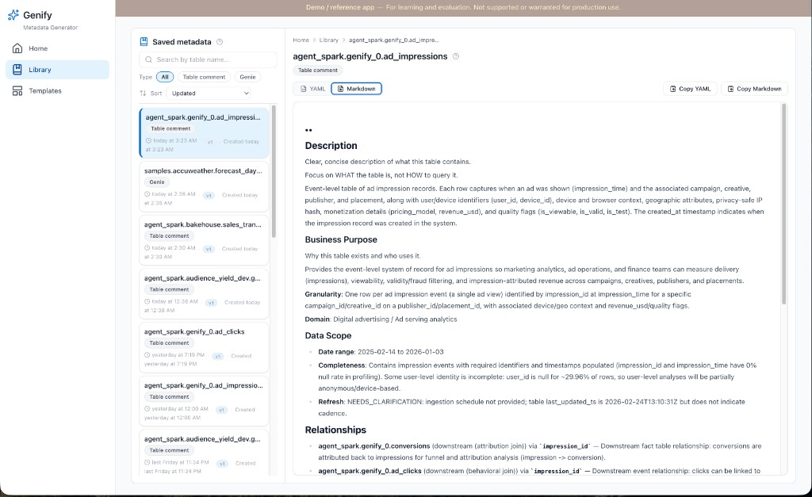
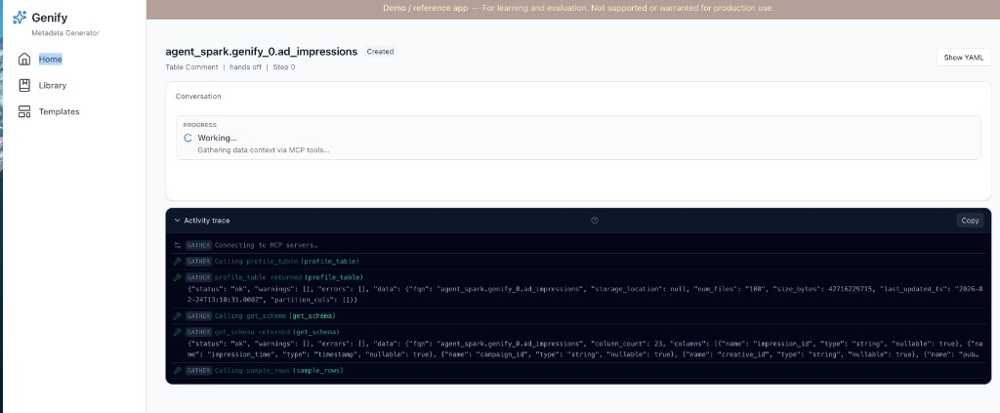
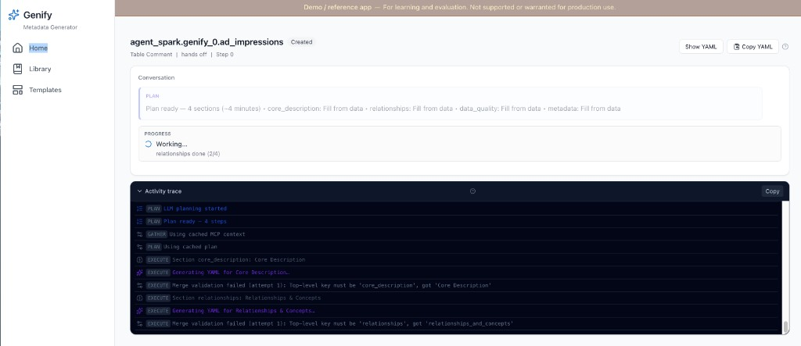
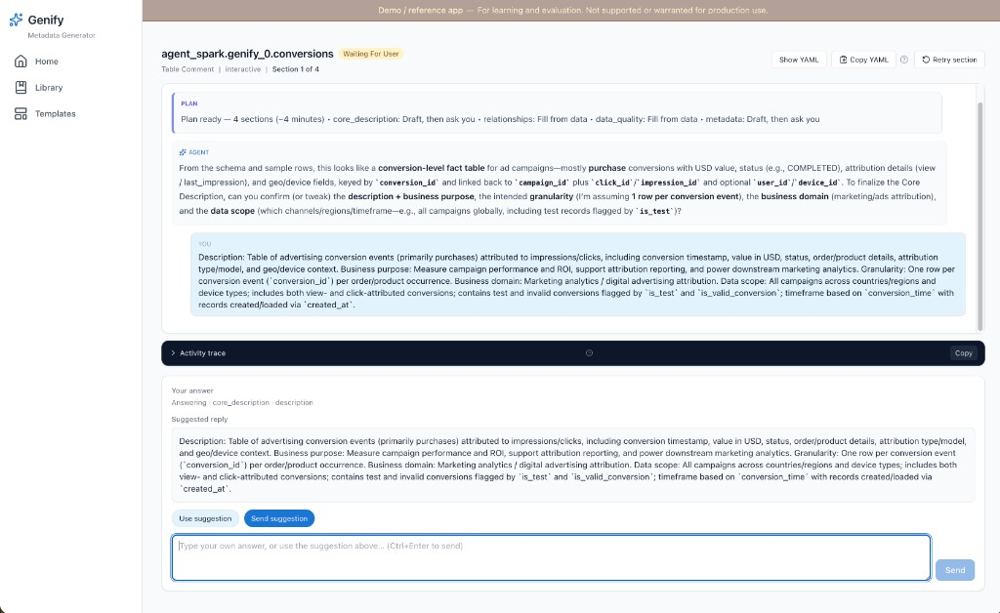
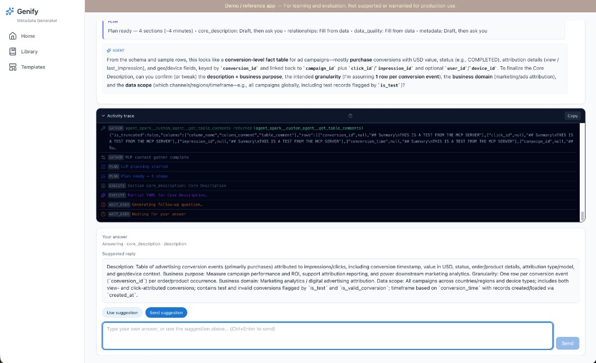
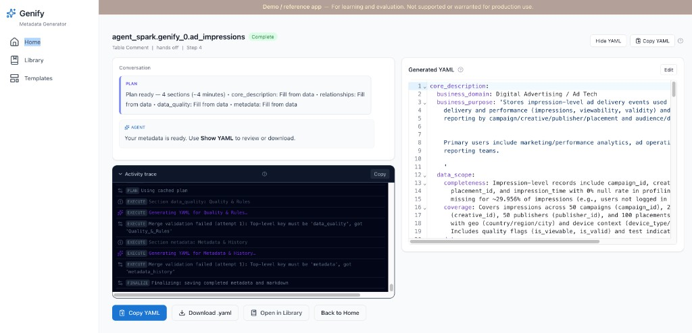
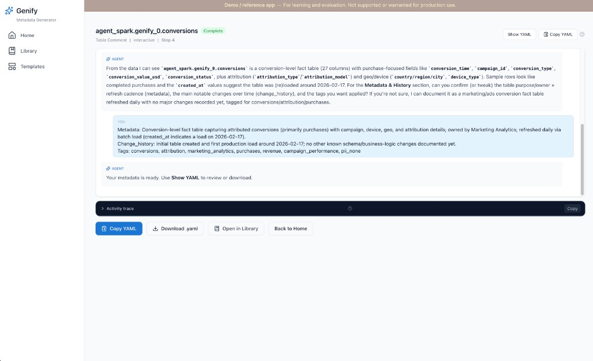
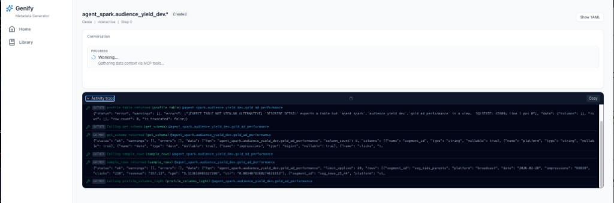

# UI design notes

The UI is part of a **demo / reference** application (see the persistent **Demo banner** in [`AppShell.jsx`](../src/genify/frontend/src/components/layout/AppShell.jsx)). Visual treatment is optimized for clarity in workshops and forks, not a full production design system.

Genify’s frontend is a **Vite + React** SPA under [`src/genify/frontend/`](../src/genify/frontend/). This page summarizes **design intent**; the component map and SSE behavior live in [architecture.md §5](architecture.md#5-agent-session-sequence-simplified).

**See also:** [product-overview.md](product-overview.md#screenshots) (screenshot gallery and journeys).

## Screenshots — Home

## Screenshots — Select Tables

Catalog and schema pickers, **Filter tables**, **Select visible** / **Clear**, and a compact **table type** pill (e.g. MANAGED). Each table **name** is on the first line; **Unity Catalog comment** is a **two-line max** preview (`line-clamp`) with **full text on hover** (`title`).

## Screenshots — Library

Search by table name; filters **All** / **Table comment** / **Genie**; sort (e.g. **Updated**). Cards show **`table_fqn`**, template type, version, and timestamps. Detail: **YAML** \| **Markdown**, CodeMirror, **Save** / **Revert**, copy actions.

## Screenshots — Templates

Split list + detail under [`components/templates/`](../src/genify/frontend/src/components/templates/): search, type filters, version sort; **Default** badge; YAML editor with upload, copy, save, revert, set default, save as new version.

## Screenshots — Session (hands-off)

**Two columns:** conversation / progress / **Activity trace** (collapsible) on the left; **Generated YAML** on the right with show/hide and copy.

- **Status pill** — Created, Executing, Waiting For User, Complete — pairs with header text (`Table Comment | hands off | …`). **Section x of y** when applicable; **Retry section** rolls back the last step (see API).
- **Hands-off** — Gather → plan → section execution; trace shows MCP calls (`GATHER …`, `Using cached MCP context` on later phases).

## Screenshots — Session (interactive)

- **Interactive** — Same gather/plan; **question** pauses with composer + optional YAML preview; see [architecture.md — Hands-off vs interactive design](architecture.md#hands-off-vs-interactive-design).
- **Question composer** — **Transcript-first:** full question text in the **Conversation** transcript, not duplicated in the composer. **Suggested reply** panel, **Use suggestion** / **Send suggestion**, textarea for a custom answer. Theme tokens align with [`tailwind.config.js`](../src/genify/frontend/tailwind.config.js) (`brand`, `slate`, `surface`).

## Screenshots — Session (complete)

- **`screenshot-session-interactive-complete.png`** — Complete with **Generated YAML** / primary actions when the right column is emphasized.
- **`screenshot-session-interactive-complete-transcript.png`** — Interactive **complete**, transcript-first: AGENT / **YOU** rounds, final assistant line, footer (**Copy YAML**, **Download .yaml**, **Open in Library**, **Back to Home**).

**Genie + MCP gather** (reference until recaptured): 

## Transcript first, trace second

- The **session** page is built around a **conversation transcript** (assistant / user / system), not a raw operational log.
- Verbose diagnostics use SSE **`trace`** events and appear in the **Activity trace** panel, **collapsed by default**. Rationale: [ADR-9](design-decisions.md#adr-9-transcript-first-session-ui).

## Responsive shell and navigation

- **Desktop:** Persistent **left sidebar** (~240px) with **Home**, **Library**, **Templates**; main content is **full width** (`flex-1 min-w-0`).
- **Small screens:** **Hamburger** opens a **drawer**; drawer closes on route change.
- Session header **Back** is **hidden from `md` up** (sidebar provides navigation).

## Progressive disclosure and feedback

- **`HelpHint`** (`?`) on dense surfaces (section titles, etc.).
- **Plan** payloads are **humanized** (readable strategies, not raw enums).
- After **`question`**, the client **closes** `EventSource`; connection warnings are **suppressed** while the user composes an answer.

## Icons and density

- Session chrome uses **Lucide** icons (avoid emoji in production session UI).

## Library and editing

- **Deep links:** `complete` SSE may include **`completed_id`** for Library routing and **`PUT /api/completed/{id}`**.

## Related files

| Concern | Entry points |
|---------|----------------|
| Layout | `layout/AppShell.jsx`, `layout/AppSidebar.jsx` |
| Session flow | `SessionView.jsx`, `SessionTranscript.jsx`, `TracePanel.jsx`, `QuestionComposer.jsx` |
| SSE client | `api.js` — `connectSSE`, `fetchJSON` |
